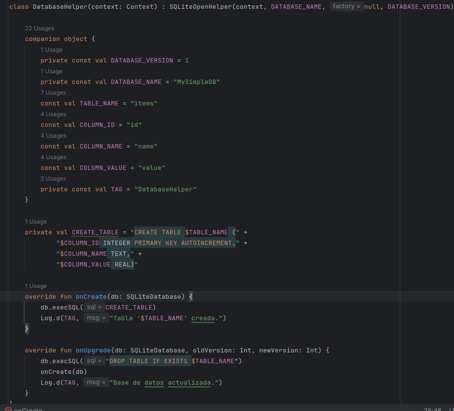
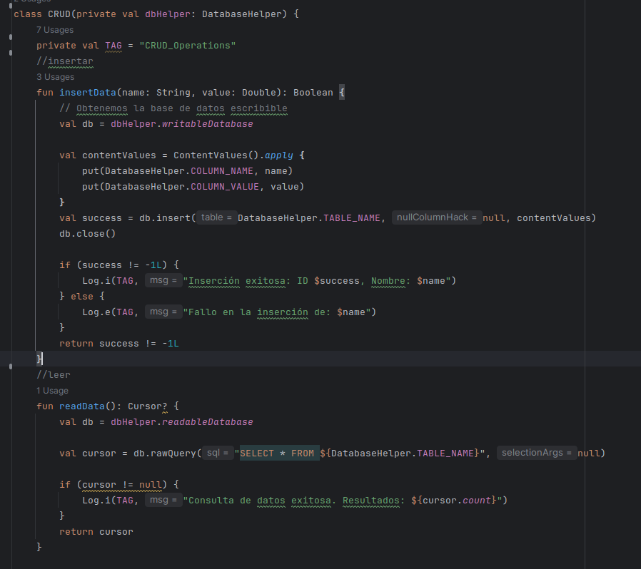
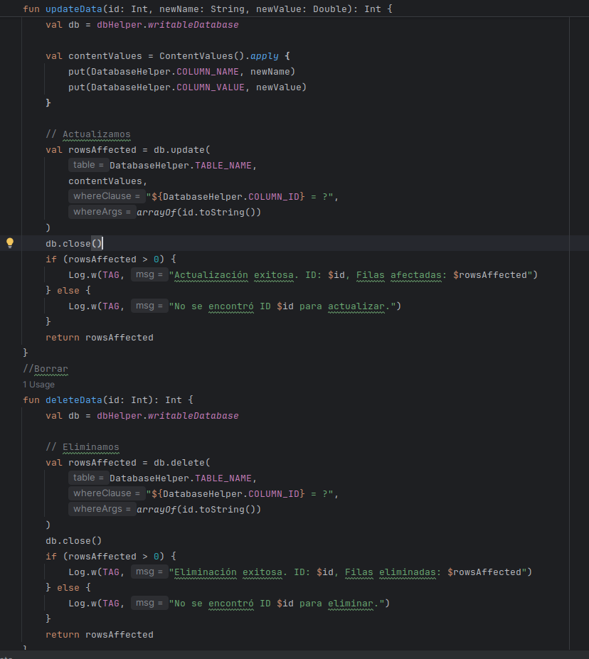
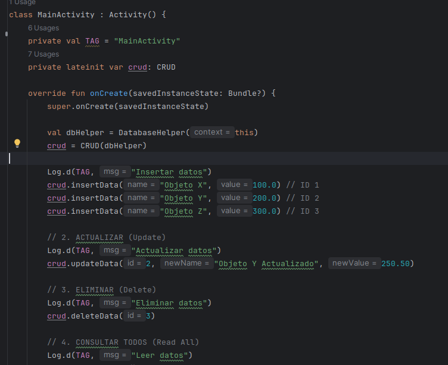

# Practica de SQLite

---
Que es?
--

En esta practica vamos a probar a hacer una aplicacion simple utilizando DBhelper y SQLite la cual solo mostrara datos basicos

---
Clase DatabaseHelper
---

Esta es la clase la cual hace de controlador, crea la base de datos con sus respectivas columnas y upgradea o downgradea segun lo pidamos

---

---

---
Clase CRUD
---

Esta clase la utilizare para controlar la base de datos haciendo las operaciones basicas como crear, upgradear, eliminar o leer datos a traves del Logcat

---

---

---

---

---
Clase Main
---

Clase que ejecuta nuestro programa de manera principal haciendo las operaciones que necesitemos

---

---
